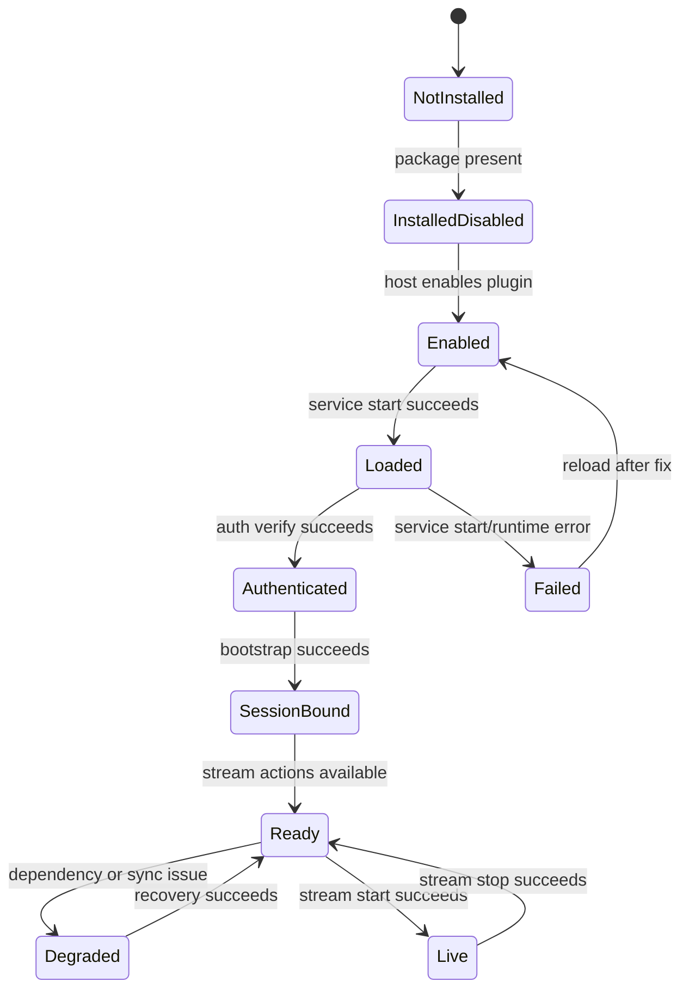
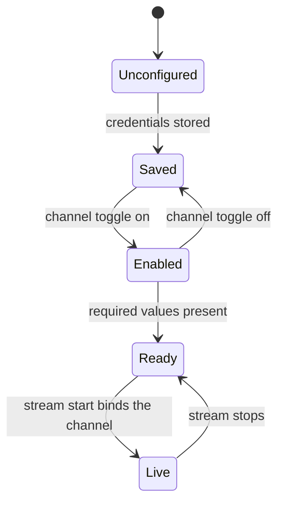
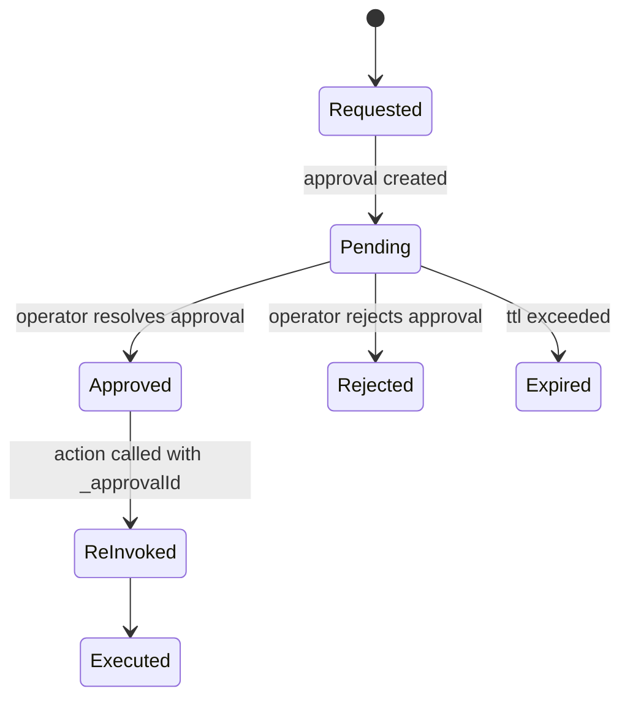
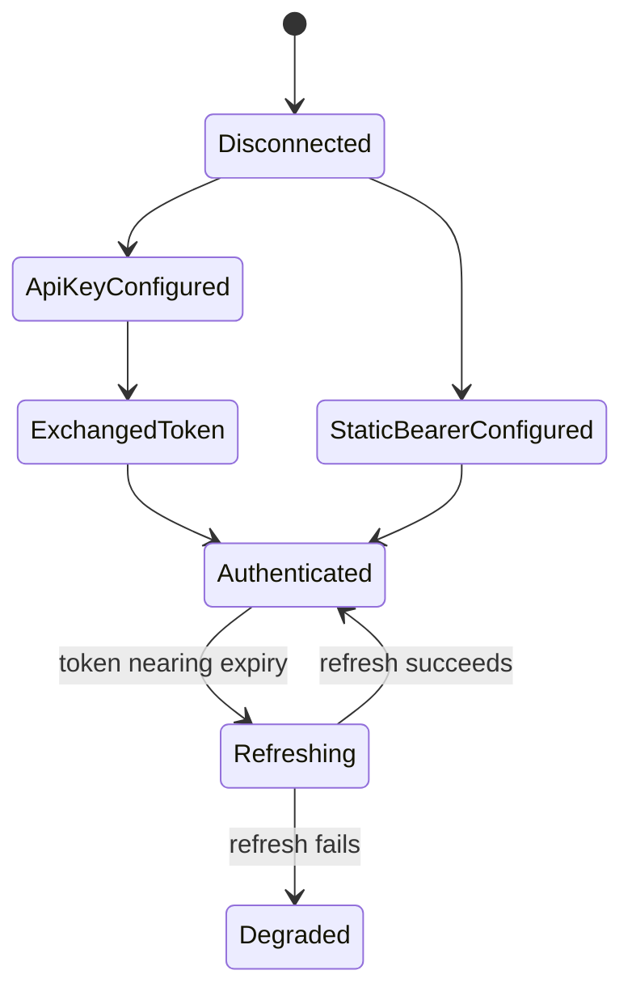
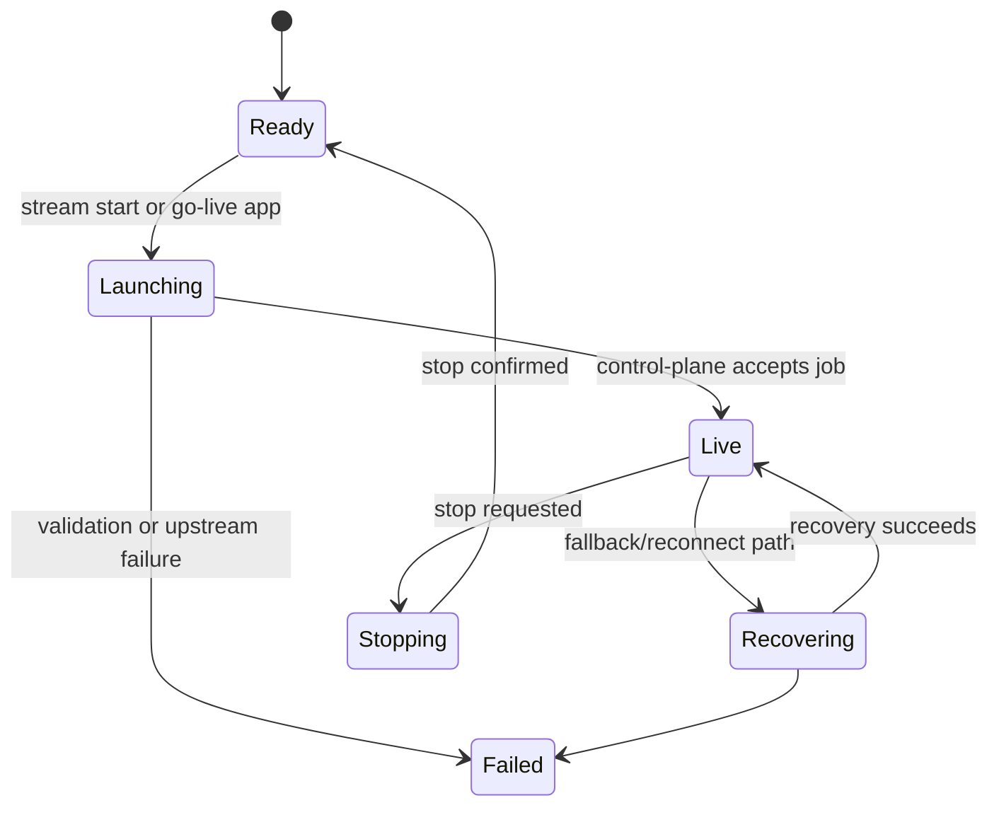

# 555 Stream — States and Transitions

This document is the public state reference for the `555 Stream` plugin.

## Operator-visible lifecycle

## State meanings

| State | Meaning |
| --- | --- |
| `installed` | package exists in the host |
| `enabled` | host policy says it should load |
| `loaded` | `StreamControlService` is running |
| `authenticated` | HTTP auth is valid |
| `sessionBound` | realtime session is bound |
| `ready` | plugin can execute stream control actions |
| `live` | an active broadcast exists |
| `degraded` | stream control is up, but a dependency is degraded |

## Channel state

Channel state is independent from stream lifecycle.

| Channel token | Meaning |
| --- | --- |
| `channelsSaved` | at least one channel has credentials persisted |
| `channelsEnabled` | at least one channel is enabled |
| `channelsReady` | enabled channels are fully configured |

## Approval state

Actions commonly approval-gated:
- `STREAM555_STREAM_START`
- `STREAM555_STREAM_STOP`
- `STREAM555_STREAM_FALLBACK`
- destructive delete actions
- guest invite/remove
- ad break mutations in production

## Auth flow

## Go-live flow

## Public rules

- `configured` must not be used as a synonym for `loaded`
- `authenticated` must not imply `sessionBound`
- `ready` means session-bound and action-capable, not merely installed
- channel readiness must be displayed separately from auth/session readiness
