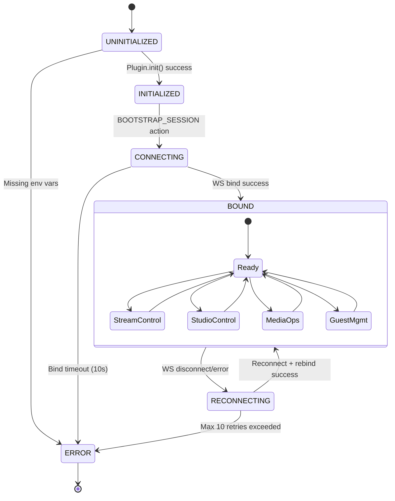
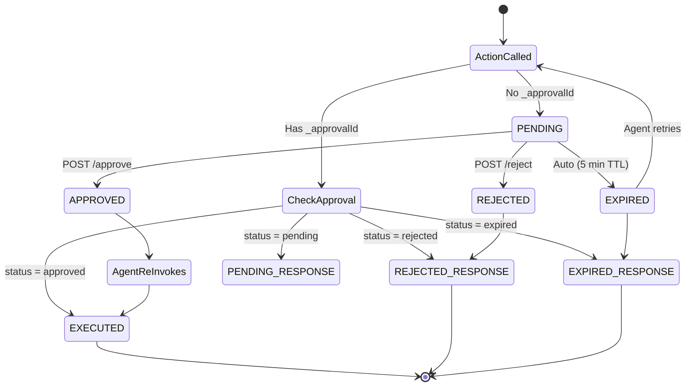
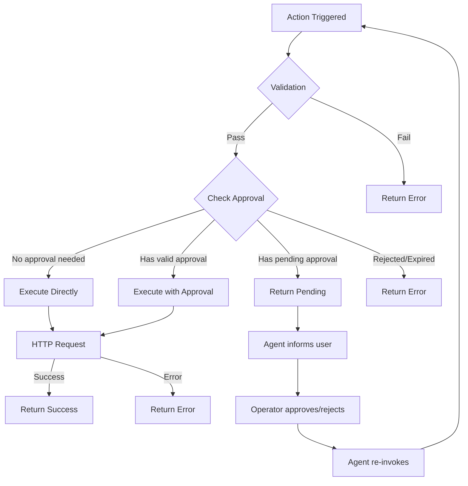
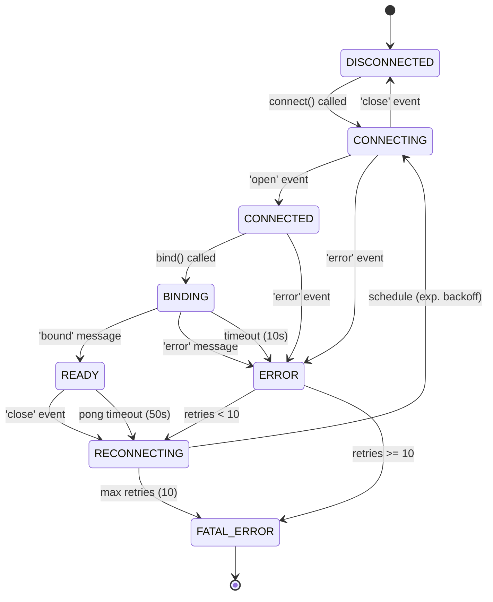
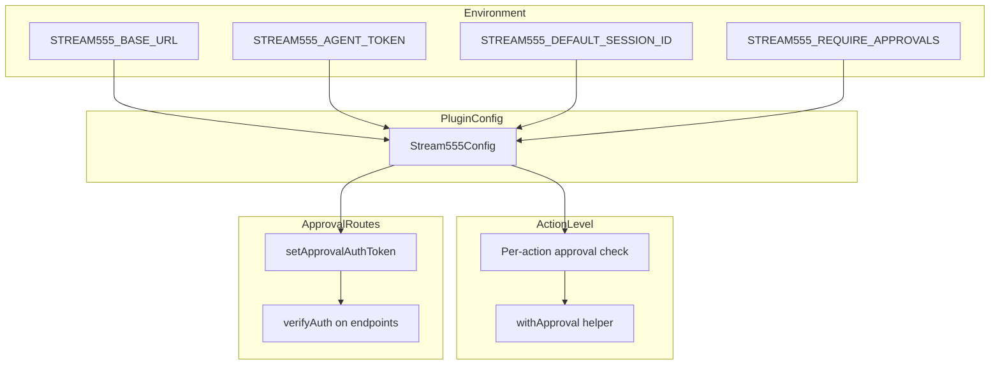
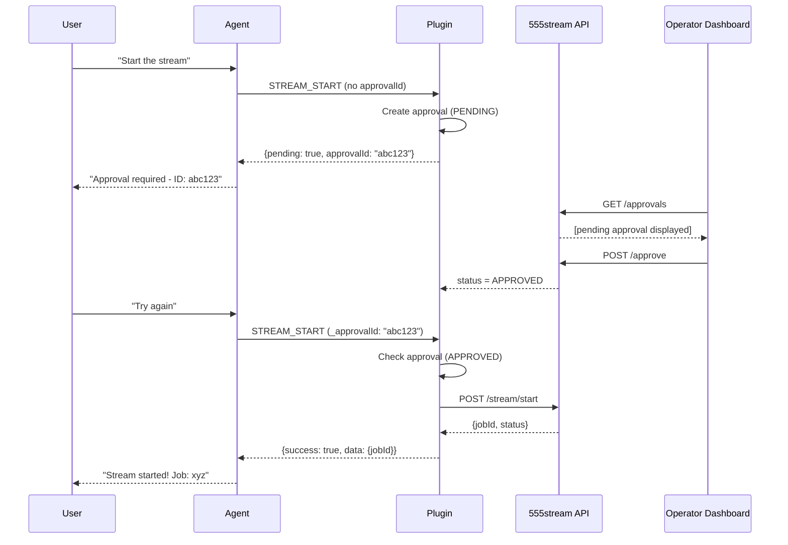

# 555stream Plugin - State Diagrams

This document describes the complete state machines for the 555stream elizaOS plugin.

## Table of Contents

1. [Agent-Plugin Lifecycle](#1-agent-plugin-lifecycle)
2. [Approval Flow](#2-approval-flow)
3. [Action Execution](#3-action-execution)
4. [WebSocket Connection](#4-websocket-connection)
5. [Configuration Hierarchy](#5-configuration-hierarchy)

---

## 1. Agent-Plugin Lifecycle

The agent goes through several states when using the 555stream plugin.



### State Descriptions

| State | Description | Available Actions |
|-------|-------------|-------------------|
| **UNINITIALIZED** | Plugin not loaded | None |
| **INITIALIZED** | Service created, HTTP/WS clients ready | HEALTHCHECK |
| **CONNECTING** | HTTP session created, WS handshake in progress | None (waiting) |
| **BOUND** | Ready state - all 26 actions available | All actions |
| **RECONNECTING** | Auto-retry with exponential backoff | Read-only |
| **ERROR** | Manual intervention required | None |

### Transitions

| From | To | Trigger | Side Effects |
|------|----|---------|--------------|
| UNINITIALIZED | INITIALIZED | `Plugin.init()` success | Service created |
| UNINITIALIZED | ERROR | Missing env vars | Error thrown |
| INITIALIZED | CONNECTING | `BOOTSTRAP_SESSION` | HTTP POST /sessions |
| CONNECTING | BOUND | WS bind success | State cache populated |
| CONNECTING | ERROR | Bind timeout | Action fails |
| BOUND | RECONNECTING | WS close/error | Auto-reconnect scheduled |
| RECONNECTING | BOUND | Reconnect + rebind | State cache refreshed |
| RECONNECTING | ERROR | 10 retries exhausted | WS enters error state |

---

## 2. Approval Flow

Actions requiring human approval go through this state machine.



### Approval States

| State | HTTP Code | Duration | Can Transition To |
|-------|-----------|----------|-------------------|
| **PENDING** | 200 | Up to 5 minutes | APPROVED, REJECTED, EXPIRED |
| **APPROVED** | 200 | Terminal | (execution) |
| **REJECTED** | 200 | Terminal | (error response) |
| **EXPIRED** | 410 | Terminal | (new approval request) |

### Actions Requiring Approval

| Action | Risk Level | Reason |
|--------|------------|--------|
| `STREAM555_STREAM_START` | HIGH | Goes live to platforms |
| `STREAM555_STREAM_STOP` | HIGH | Stops live stream |
| `STREAM555_STREAM_FALLBACK` | HIGH | Changes stream source |
| `STREAM555_GRAPHICS_DELETE` | MEDIUM | Permanent deletion |
| `STREAM555_SOURCE_DELETE` | MEDIUM | Permanent deletion |
| `STREAM555_GUEST_INVITE` | MEDIUM | External access |
| `STREAM555_GUEST_REMOVE` | MEDIUM | Kicks participant |
| `STREAM555_VIDEO_DELETE` | MEDIUM | Permanent deletion |

**Conditional:** `STREAM555_PLATFORM_CONFIG` requires approval only when setting stream keys.

---

## 3. Action Execution

Every action follows this execution flow.



### Validation Checks

1. Service exists and is initialized
2. Session is bound (for most actions)
3. Required parameters are present
4. Parameter types are valid

### Result States

| State | Structure | When |
|-------|-----------|------|
| **Success** | `{ success: true, data: {...} }` | Action completed |
| **Pending** | `{ success: false, pending: true, approvalId: "..." }` | Awaiting approval |
| **Rejected** | `{ success: false, error: "Rejected by operator" }` | Approval denied |
| **Expired** | `{ success: false, error: "Approval expired" }` | 5 min TTL exceeded |
| **Error** | `{ success: false, error: "..." }` | Validation/execution failed |

---

## 4. WebSocket Connection

The WebSocket client manages real-time communication.



### Connection Parameters

| Parameter | Default | Description |
|-----------|---------|-------------|
| `reconnectInterval` | 5000ms | Base delay between reconnects |
| `maxReconnectAttempts` | 10 | Max retries before giving up |
| `pingInterval` | 25000ms | Keepalive ping frequency |
| `pongTimeout` | 50000ms | Max time to wait for pong (2x ping) |

### Reconnect Backoff

```
Attempt 1:  5 seconds
Attempt 2: 10 seconds
Attempt 3: 20 seconds
Attempt 4: 40 seconds
Attempt 5+: 60 seconds (max)
```

### WebSocket Messages

**Client → Server:**
```typescript
// Bind to session
{ type: 'bind', sessionId: string, token: string, clientId: string }

// Patch state
{ type: 'patch_state', sessionId: string, requestId: string, patch: object }

// Keepalive
{ type: 'ping' }
```

**Server → Client:**
```typescript
// Bind success
{ type: 'bound', sessionId: string, productionState: object, sequence: number }

// State update
{ type: 'state_update', sessionId: string, productionState: object, sequence: number }

// Stream status
{ type: 'stream_status', sessionId: string, active: boolean, jobId?: string }

// Platform status
{ type: 'platform_status', sessionId: string, platformId: string, status: string }

// Stats
{ type: 'stats', sessionId: string, fps?: number, kbps?: number, duration?: string }

// Acknowledgment
{ type: 'ack', requestId: string, sequence?: number }

// Error
{ type: 'error', requestId?: string, error: string }

// Keepalive response
{ type: 'pong' }
```

---

## 5. Configuration Hierarchy

Configuration flows from environment variables through the plugin to actions.



### Environment Variables

| Variable | Required | Default | Description |
|----------|----------|---------|-------------|
| `STREAM555_BASE_URL` | Yes | - | 555stream control-plane URL |
| `STREAM555_AGENT_TOKEN` | Yes | - | Bearer token for API |
| `STREAM555_DEFAULT_SESSION_ID` | No | - | Auto-bind session on startup |
| `STREAM555_REQUIRE_APPROVALS` | No | `true` | Enable approval flow |

### REQUIRE_APPROVALS Effect

| Value | Behavior |
|-------|----------|
| `true` (default) | 8 dangerous actions require operator approval |
| `false` | All actions execute immediately (**DEVELOPMENT ONLY**) |

---

## Complete Interaction Sequence

Here's the full flow for an agent starting a stream with approval:



---

## Summary

The 555stream plugin uses a multi-layered state machine approach:

1. **Agent Lifecycle** - Manages connection and readiness
2. **Approval Flow** - Protects dangerous operations
3. **Action Execution** - Validates and routes requests
4. **WebSocket Connection** - Maintains real-time sync
5. **Configuration** - Controls behavior at multiple levels

This architecture ensures:
- **Safety**: Dangerous actions require explicit approval
- **Reliability**: Auto-reconnect with exponential backoff
- **Visibility**: Real-time state sync via WebSocket
- **Flexibility**: Configurable approval requirements
