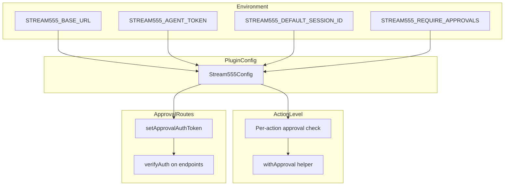
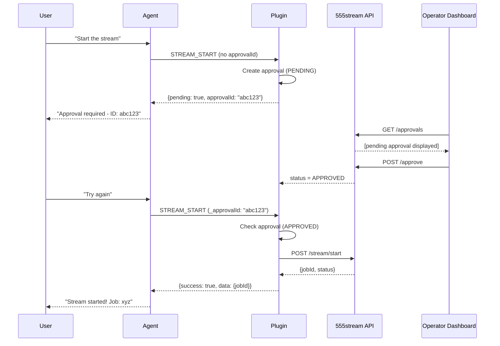

# 555 Stream — State Diagrams

Canonical state documentation now lives here:

- `STATES_AND_TRANSITIONS.md`

Use that file for:
- plugin lifecycle
- auth/session state
- channel readiness state
- go-live state
- approval state

// Stats
{ type: 'stats', sessionId: string, fps?: number, kbps?: number, duration?: string }

// Acknowledgment
{ type: 'ack', requestId: string, sequence?: number }

// Error
{ type: 'error', requestId?: string, error: string }

// Keepalive response
{ type: 'pong' }
```

---

## 5. Configuration Hierarchy

Configuration flows from environment variables through the plugin to actions.



### Environment Variables

| Variable | Required | Default | Description |
|----------|----------|---------|-------------|
| `STREAM555_BASE_URL` | Yes | - | 555stream control-plane URL |
| `STREAM555_AGENT_TOKEN` | Yes | - | Bearer token for API |
| `STREAM555_DEFAULT_SESSION_ID` | No | - | Auto-bind session on startup |
| `STREAM555_REQUIRE_APPROVALS` | No | `true` | Enable approval flow |

### REQUIRE_APPROVALS Effect

| Value | Behavior |
|-------|----------|
| `true` (default) | 8 dangerous actions require operator approval |
| `false` | All actions execute immediately (**DEVELOPMENT ONLY**) |

---

## Complete Interaction Sequence

Here's the full flow for an agent starting a stream with approval:



---

## Summary

The 555stream plugin uses a multi-layered state machine approach:

1. **Agent Lifecycle** - Manages connection and readiness
2. **Approval Flow** - Protects dangerous operations
3. **Action Execution** - Validates and routes requests
4. **WebSocket Connection** - Maintains real-time sync
5. **Configuration** - Controls behavior at multiple levels

This architecture ensures:
- **Safety**: Dangerous actions require explicit approval
- **Reliability**: Auto-reconnect with exponential backoff
- **Visibility**: Real-time state sync via WebSocket
- **Flexibility**: Configurable approval requirements
